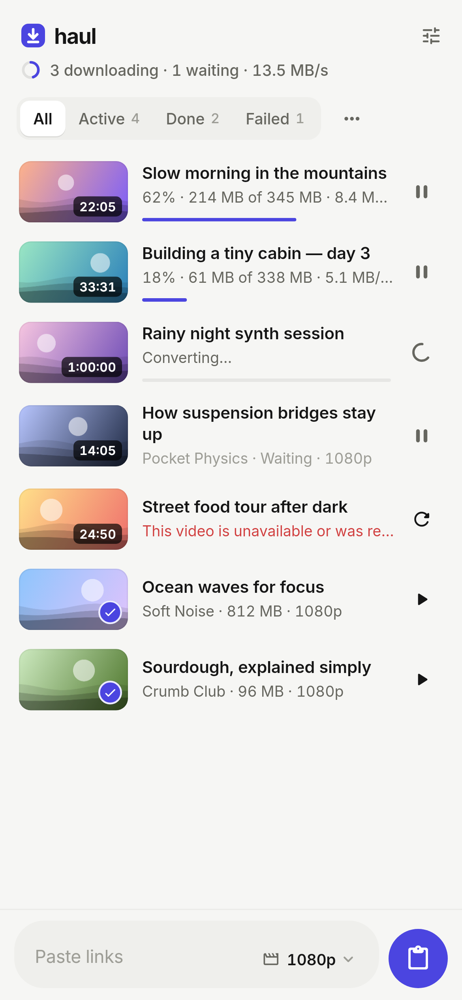
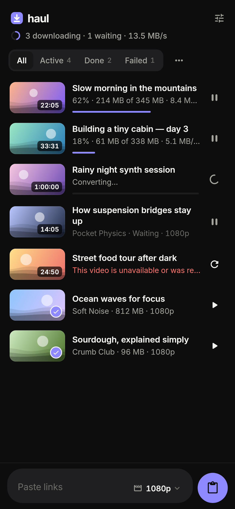
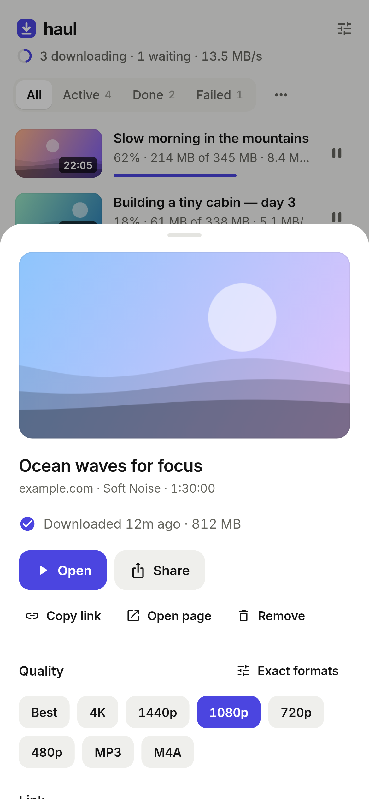
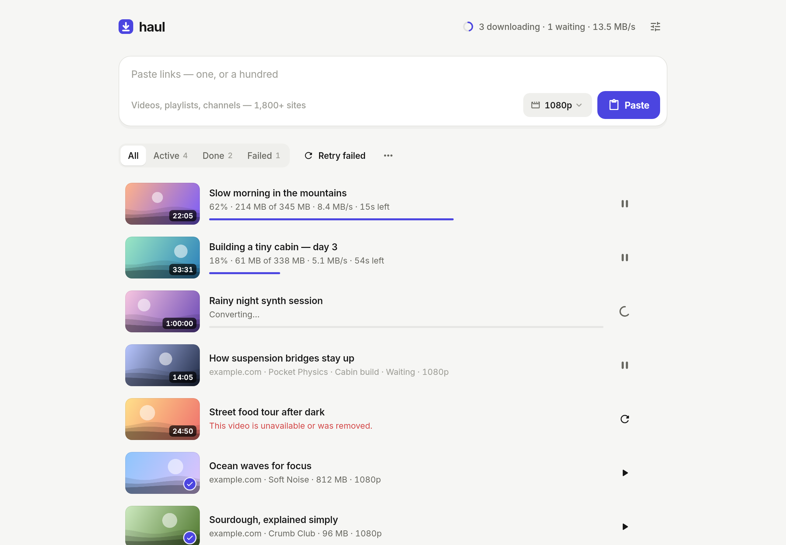

# Haul

**Paste links, get videos.** A calm, fast front-end for [yt-dlp](https://github.com/yt-dlp/yt-dlp) for Android, macOS, Windows and Linux.

Share a video to Haul from YouTube, Instagram, TikTok, X or your browser, or paste a hundred links at once. Whole playlists and channels work too. Haul queues them, downloads several at a time, and saves them where your gallery and file manager can see them.

<p>
  
  
  
</p>



## Getting it

Every push builds the apps in GitHub Actions. Open the latest run of the **Build** workflow and download:

| Platform | File | Notes |
| --- | --- | --- |
| Android (most phones) | `Haul-android-arm64-v8a.apk` | Allow "install unknown apps" for your browser or file manager. |
| Android (older/32-bit) | `Haul-android-armeabi-v7a.apk` | |
| macOS | `Haul-macos.zip` | Not notarized yet: right-click → **Open** the first time. |
| Windows | `Haul-windows-x64.zip` | Unzip and run `haul.exe`. |
| Linux | `Haul-linux-x64.tar.gz` | Unpack and run `bundle/haul`. |

Pushing a tag like `v0.1.0` publishes all of them as a GitHub release.

## What it does

**Getting links in**
- **Share → Haul** on Android. One tap from any app and it's downloading.
- **One box for one link or a hundred.** Haul pulls every URL out of whatever you paste: chat messages, markdown, comma-separated lists.
- **Paste button**: with the box empty, the main button reads your clipboard and starts immediately.
- **Playlists and channels** expand into their videos, with an **Undo** if you didn't mean to add 400 videos.
- **Desktop extras**: drop a `.txt` full of links onto the window. If you come back with a link on your clipboard, Haul offers to download it. Press `⌘/Ctrl+V` anywhere to add from the clipboard.
- **Duplicates are skipped**, including the same video under different URLs (`youtu.be/…` vs `youtube.com/watch?v=…`, tracking parameters and so on). Pasting a failed link again simply retries it.

**While it works**
- **Parallel downloads** (1–8, default 3), with titles and thumbnails fetched ahead of time so a big paste fills in quickly.
- **One smooth progress bar per video**, even when yt-dlp downloads video and audio separately and merges them.
- **Pause, resume, retry**: partial files are kept, so resuming continues where it stopped, even after quitting the app.
- **Keeps going in the background on Android**, with a quiet progress notification.

**What you get**
- **Quality presets**: Best, 4K, 1440p, 1080p, 720p, 480p, MP3, M4A. You can also pick an exact format per video.
- **"Plays everywhere" by default**: H.264/AAC in MP4 for the best compatibility. Turn it off in Settings for the absolute best quality (VP9/AV1).
- **Tidy files**: a folder per playlist, a choice of file-name styles, and embedded cover art and details.
- **Skip what you already have**: re-adding a channel later only fetches the new videos.
- **Errors in plain words**, each with a next step: "Use best available", "Update engine", or "Sign in with your browser" (desktop).

## How it works

```
                ┌──────────────────────── Flutter (lib/) ────────────────────────┐
 paste/share →  │ links.dart → QueueController → ytdlp.dart (args + output parser)│
                └──────────────┬──────────────────────────────────┬──────────────┘
                               │ Engine                           │
             DesktopEngine (dart:io Process)          AndroidEngine (platform channel)
             yt-dlp / ffmpeg / deno binaries          youtubedl-android: embedded Python,
             fetched once into app support            yt-dlp, ffmpeg, QuickJS (Kotlin)
```

- Both engines run **the same yt-dlp arguments** and feed stdout into the same parser. Haul adds `--progress-template` and `--print` hooks, so progress, final file paths and per-stream sizes arrive as structured lines rather than scraped text.
- **Desktop**: on first run Haul downloads the official standalone `yt-dlp` and, optionally, ffmpeg (for HD merging and MP3) and Deno (for every YouTube quality). It uses system copies if you already have them. Everything can be updated from **Settings → Engine**.
- **Android**: [youtubedl-android](https://github.com/JunkFood02/youtubedl-android) ships Python, ffmpeg and QuickJS inside the APK. yt-dlp updates itself at most once a day. Files go to `Download/Haul` and are registered with the media scanner, so they show up in Gallery and Files.
- **iOS** isn't supported: iOS doesn't allow apps to run yt-dlp's Python and helper programs on the device.

## Design

The whole palette is paper, ink in three strengths, one indigo accent and one warning red. Everything else is opacity. Type is Inter with tabular figures, so numbers don't jitter while they count. Motion is short (140–420 ms) and soft: rows fold in and out, progress glides, statuses cross-fade. Long lists stay smooth because the queue is a plain lazy `ListView` with per-row animations.

Tokens live in `lib/theme/theme.dart`.

## Development

Requires Flutter 3.47+ (stable). For Android, an SDK with platform 36. For Linux desktop, `libgtk-3-dev`.

```sh
flutter pub get
flutter run                       # pick a device: Android phone, macos, windows, linux
flutter test                      # unit + widget tests (uses a fake engine)
flutter analyze

flutter build apk --release --split-per-abi
flutter build macos | windows | linux

# Regenerate the README screenshots from the real UI:
HAUL_SCREENSHOTS=1 flutter test test/screenshots_test.dart
```

```
lib/
  core/       links, models, yt-dlp args + output parsing (pure Dart, unit tested)
  services/   engines (desktop process / Android channel) and OS integration
  state/      app state, queue scheduler, persistence
  theme/      palette, type, motion tokens
  ui/         home (composer, queue), details sheet, settings, setup
android/app/src/main/kotlin/dev/haul/haul/
  HaulEngine.kt       runs yt-dlp via youtubedl-android, streams output to Dart
  DownloadService.kt  foreground service + progress notification
  MainActivity.kt     share intent, open/share files, permissions
```

## Fair use

Haul is a personal-archiving tool. Downloading may break a platform's terms of service. Only download what you have the right to keep, and support the people who make it.

## License

GPL-3.0 (see `LICENSE`). The Android app bundles GPL-3.0 components (youtubedl-android, ffmpeg), so the project as a whole uses the same license.

## Credits

- [yt-dlp](https://github.com/yt-dlp/yt-dlp): does all the actual work (Unlicense).
- [youtubedl-android](https://github.com/JunkFood02/youtubedl-android): yt-dlp on Android (GPL-3.0).
- [yoinks](https://github.com/pablostanley/yoinks) by Pablo Stanley: the "paste. yoink. done." spirit.
- [Inter](https://rsms.me/inter/) by Rasmus Andersson (SIL Open Font License, `assets/fonts/Inter-LICENSE.txt`).
- ffmpeg builds from [yt-dlp/FFmpeg-Builds](https://github.com/yt-dlp/FFmpeg-Builds) and [Martin Riedl](https://ffmpeg.martin-riedl.de/); [Deno](https://deno.com).
