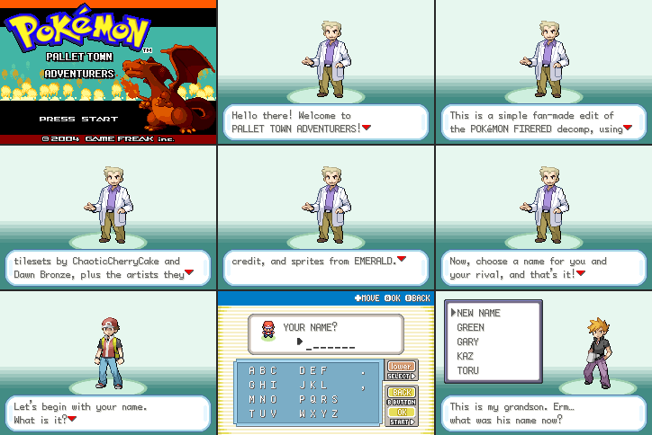
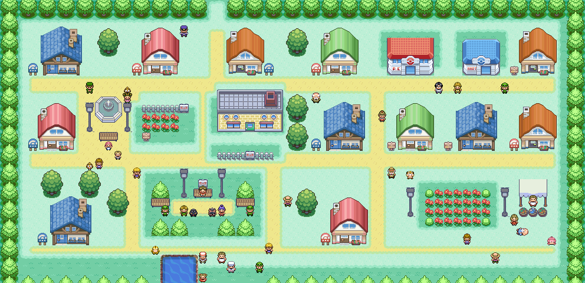

# Pallet Town Adventurers

A small fan-made game built on [pret/pokefirered](https://github.com/pret/pokefirered):
Pallet Town, grown into a busy city, is the whole game. Oak's lab, the garden,
the pond and every original event are kept as they are in FireRed.

- **Just Pallet Town:** every other map was removed from the game (the tilesets
  all stay). What's left is Pallet Town, its 18 interiors, and the link-cable rooms
  that the Pokémon Center's upstairs uses. The roads out of town are closed.
- **The name:** the title screen reads *Pallet Town Adventurers* under the Pokémon logo,
  and the cartridge header title is `PALLET TOWN`.
- **A short intro:** New Game goes straight to Professor Oak. He says this is a simple
  fan-made edit of the FireRed decomp, credits the tilesets (ChaoticCherryCake, Dawn
  Bronze and their artists) and the Emerald sprites, and asks for your name and your
  rival's. That's it: no controls guide, no Nidoran, and no boy/girl question (you play
  as the boy).



- **Size:** the map goes from 24×20 to 62×30.
- **Streets:** sand paths in FireRed's own style. There's a main street from the Route 1
  gate, three avenues past every row of front doors, an east street, a
  fountain square and lanes around the park.
- **Varied houses:** pink, green, blue and orange cottages. The green roofs are a palette
  recolour of the pink design, so they cost no extra tiles.
- **Pallet Park, a small wood:** FireRed's own trees on a forest floor. A lamp-lit
  bench sits at its head, with benches either side of a sandy clearing where two
  trainers battle with Poochyena and Zigzagoon (Emerald's own overworld
  sprites, imported with their exact colours).
- **12 enterable buildings, each with its own interior and residents:**
  - **Pokémon Center:** the nurse heals you and sets your respawn point, and the 2F link rooms work.
  - **Poké Mart:** sells Potions, Antidotes, Paralyze Heals, Awakenings, Burn Heals and Escape Ropes.
  - **Café:** a chef, a pacing waitress, a regular, and Brendan visiting from Hoenn.
  - **Pokémon Nursery:** Clefairy, Pikachu, Jigglypuff and Nidoran♀.
  - **Trainers' School:** a teacher and two pupils at their desks.
  - **Pokémon breeder's house**, plus six family homes (Harper, Aoki, Bell, Vale, Marsh, Kowalski),
    one of them with an upstairs.
- **Bigger Oak's Lab, Pokémon Center and Poké Mart:**
  - **Lab:** a new east research wing with a second computer desk, a research table, a healing
    machine, notice boards and three new staff. The original room and Oak's cutscenes are untouched.
  - **Pokémon Center:** it grows to One Island's larger plan, with a lounge (TV, bookshelf, plant,
    table) where visitors sit.
  - **Mart:** two more shelf aisles and fridge sets.
  - All three are built from FireRed's own furniture tiles (`pallet_upgrade/interiors.py`);
    see `screenshots/pallet_interiors_expanded.png`.
- **Farmers' market stall** in the east square: a canopy and baskets of produce,
  and a vendor you talk to across the baskets. He sells Fresh Water, Soda Pop and Lemonade.
- **Townsfolk:** 14 townsfolk, each with their own personality. There's a policeman at the gate,
  a mail carrier on his round, a jogger running laps of East Street, a shopper
  at the stall, a gentleman walking his Meowth, a man napping in the sun,
  kids playing tag, a construction worker, and May visiting from Littleroot in the
  Pokémon Center, and two kids mid-battle in the park. Seven Pokémon are out and about
  (two Pidgey, Meowth, Slowpoke, Psyduck, Poochyena, Zigzagoon), and talking to one plays its cry.
- **14 beginner trainers** spread across town. Some are relaxing in the park or the
  flower garden, some wander about, and some are waiting at the harbour to head
  for Cinnabar ("I'll use my newly caught POKéMON on you, rookie!").
  They never start a battle themselves. Before you have a Pokémon they just
  chat; after that they ask YES/NO, and after you beat them they have a parting line.
  Their teams are first-stage Pokémon at levels 3–5.



(The whole town with everyone in place. `pallet_city_overview.png` is the bare map.)

In-game screenshots: `screenshots/pallet_city_tour.png` (eight spots around town),
`pallet_park_battle.png`, `pallet_market_stall.png`, `pallet_pokemon_center.png` and
`pallet_cinnabar_trainer.png`. Every interior, with its residents drawn in, is in
`pallet_city_interiors.png`, and the original town is in `pallet_original.png`.

Tile credits and license terms are in [CREDITS.md](CREDITS.md). The
ChaoticCherryCake tiles are CC BY-NC-SA, so this is **non-commercial only**.

## What changed in the game

| | |
|---|---|
| Layout | `PalletTown_Layout` is now 62×30. The original town sits in the middle (shifted 10 columns right), and ten rows were inserted above the original bottom edge, so the pond and the seams with Route 1 and Route 21 are unchanged. |
| Tileset | `gTileset_PalletTown` was redrawn: the 376 usable tiles (the last 8 of the 384 are reserved for door animations), 6 palettes (one is the green-roof recolour), 239 metatiles. Four near-identical tiles were merged; each pair differs by a single pixel one shade apart. The art has about 190 colours for 90 palette slots. Palettes start from object groups (each cottage design, the lab, the rest), so one object's tiles share a palette with no blocky seams. The three roof shading ramps are kept exact, and every palette colour is a real source colour. Tiles that already exist in the General tileset are referenced from there. Ground-level objects sit on the metatile's second layer, so they cost the same tiles on any ground. Metatiles 682/683/690/698 are unchanged, because Route 1 uses them. |
| Other maps | Removed by `pallet_upgrade/strip_maps.py`: 415 maps and 342 layouts. There are three map groups: link rooms, Pallet Town, and its interiors. The engine still names some removed maps in its code (Safari Zone, Sevii quests, the S.S. Anne and others), so their `MAP_*`, `LAYOUT_*` and `LOCALID_*` constants are kept in generated `*_compat.h` headers. Their values never match a real map. The 847 script and text labels that shared code still points at become empty stand-ins (`data/maps/removed_maps.inc`). Viridian School's scripts stay because Pallet's school uses its blackboard and notebook. Heal locations of removed towns lead home. Route 1's layout is kept for the Teachy TV demo. |
| Intro and title | `pallet_upgrade/intro.py` shortens `src/oak_speech.c` and rewrites Oak's lines in `data/text/new_game_intro.inc`. `pallet_upgrade/title.py` redraws the subtitle block of the title logo in the game's own font, bold, using only colours already in the logo's palette. |
| Events | All original warps, signs, triggers and NPCs moved with the town. Hard-coded positions in `PalletTown/scripts.inc` and the Pallet heal location were moved too. |
| Interiors | Oak's Lab widened from 13×14 to 21×14. The Pokémon Center 1F gets its own 19×11 layout (based on One Island's) and the Mart its own 17×9 layout. The standard shared layouts are not changed. |
| New maps | 14 interior maps (`PalletTown_*`), in a new map group. They reuse FireRed's interior layouts, and their door warps are aligned to each layout's doormat. |
| Doors | New door-opening animations for each house design, registered in `src/field_door.c`. The Pokémon Center and Mart use FireRed's sliding doors. |
| Trainers | 14 new trainers (`TRAINER_PALLET_*`, ids 743–756; `NUM_TRAINERS` is now 757 of the 768 that fit), defined in `pallet_upgrade/trainers_data.py`. |
| Sprites | `OBJ_EVENT_GFX_POOCHYENA` and `OBJ_EVENT_GFX_ZIGZAGOON` were added (`pallet_upgrade/sprites.py`), copied from pret/pokeemerald. They share one 14-colour palette in the special NPC palette slot. |
| Data | Every building, resident, townsperson, street, the park and the market stall is defined in `pallet_upgrade/city_data.py`. |

Played through automatically in the emulator on the final ROM, by the scripts in
`harness/` (they walk using the player's real position from RAM):

- `test_doors.py`: every door and staircase. You arrive on the exact doormat
  square and leave in front of the same door.
- `test_talk.py`: every character and every sign in town and in every
  interior (118 in all) opens its dialogue. Wanderers are tracked live.
- `test_trainers.py`: all 14 trainers.
  - Before you have a Pokémon, they only chat.
  - Walking into their line of sight never starts a battle.
  - They ask YES/NO; NO lets you go.
  - YES starts a real battle, which the test wins; afterwards they give a parting line and never rematch.
- `test_services.py`: buying at the Poké Mart and at the market stall (money
  goes down), the nurse heal, and that the old road north to Route 1 is closed.
- `test_nomon.py`: before you have a Pokémon, the nurse explains she needs one to
  heal (the empty-party heal used to hang the game). The PC and the link-room
  receptionists also answer and let you go.
- `test_collision.py`: walks into every solid square of the town that borders a
  walkable one (trees, bushes, benches, lamps, walls, fences, signs, the stall)
  and checks the game stops you.
- New game: the short intro, naming yourself and your rival, Oak's cutscene, choosing a
  starter and the rival battle (`mkstate.sh`, `mkstarter.py`). Saving and Continue were
  also checked by hand on the final ROM.
- `run_all.sh OUTDIR` remakes the save states from the current ROM and runs every test above.

Checked automatically on every rebuild (`check_reach.py`, `compose.py` audits):

- **Reachability:** every NPC, trainer, sign and door can be reached and faced. The stall vendor counts
  as reachable across the counter.
- **Interiors:** every resident stands on open floor (not furniture or the doormat), and every exit
  is on a real doormat.
- **Drawing:** nothing at ground level is drawn over the player, and no blocked square is invisible.
- **Text:** every line of new dialogue fits the message box in the game's own font, measured
  against the widest line in FireRed itself (`check_text.py`), with no box holding three lines.
- **Hidden characters:** no character can stand or wander in a square where a roof, tree crown or
  lamp head is drawn over them (`check_cover.py`). Lamp heads and tree crowns are solid.

## Rebuilding

```bash
cd pallet-town-upgrade
harness/setup.sh                      # installs the toolchain and clones + builds pokefirered (matching ROM)
git -C pokefirered checkout 037335f4c725d7c9aecdac87066f2002b4bd7e14
git -C pokefirered apply ../pokefirered.patch
make -C pokefirered -j"$(nproc)"      # -> pokefirered/pokefirered.gba
```

The patch reproduces the tested ROM byte for byte on a fresh clone. It also deletes the
removed maps' folders, so it is about 4 MB.

To change the design, edit `pallet_upgrade/city_data.py` (or `compose.py` for
art) and run `pallet_upgrade/rebuild.sh`:

1. `compose.py` lays the town out at pixel level: ground, autotiled streets,
   objects (split into below/above-the-player parts), collision and behaviours.
2. `build.py` turns that into a GBA tileset. It reuses primary tiles, clusters
   into 6 palettes, dedupes with flips, and writes the metatiles and the map.
3. `doors.py` makes the door animations and registers them.
4. `wire.py` writes the map JSON, scripts, trainers, shops, interiors,
   connections and heal location. It always starts from the committed files.
   `sprites.py` imports the Emerald overworld Pokémon. `interiors.py` builds the bigger lab,
   Pokémon Center and Mart.
5. `strip_maps.py` removes every other map. `intro.py` writes the short intro and the cartridge
   title, and `title.py` writes the title logo. (`rebuild.sh` first restores the original maps
   from git, so the steps before it can read them.)
6. `check_reach.py` and `check_cover.py` run the checks above and fail the build on any problem.

`pallet_upgrade/orig/` is a copy of the original Pallet Town tileset and map
that the pipeline reads from.

## Emulator tools (`harness/`)

- `gba.c` runs the ROM without a screen (via libmgba). It takes scripted button presses,
  screenshots and save states. With `--record DIR` it saves every frame that changes,
  plus logs of inputs and runs. `pos`, `step DIR` and `face DIR` read the player's position from RAM
  (`source gbaenv.sh` first).
- `walk.py` is a position-aware driver. It finds paths over the real collision map, walks
  them step by step, re-plans around NPCs, and talks to people (`Game.goto`, `Game.talk`).
- `mkstate.sh` and `mkstarter.py` replay a new game on the current ROM. The first leaves you outside home; the second goes on
  through Oak, a starter and the rival battle.
- `sweep.py` enters and leaves every building and saves a screenshot of each.
- `review.py` browses a recording: a summary, contact sheets, frames by time, diffs, and a video.
- `tilesets.py` renders any tileset or map from the decomp with its real palettes.
- `qa.py` runs a scripted sequence and puts the screenshots side by side.
