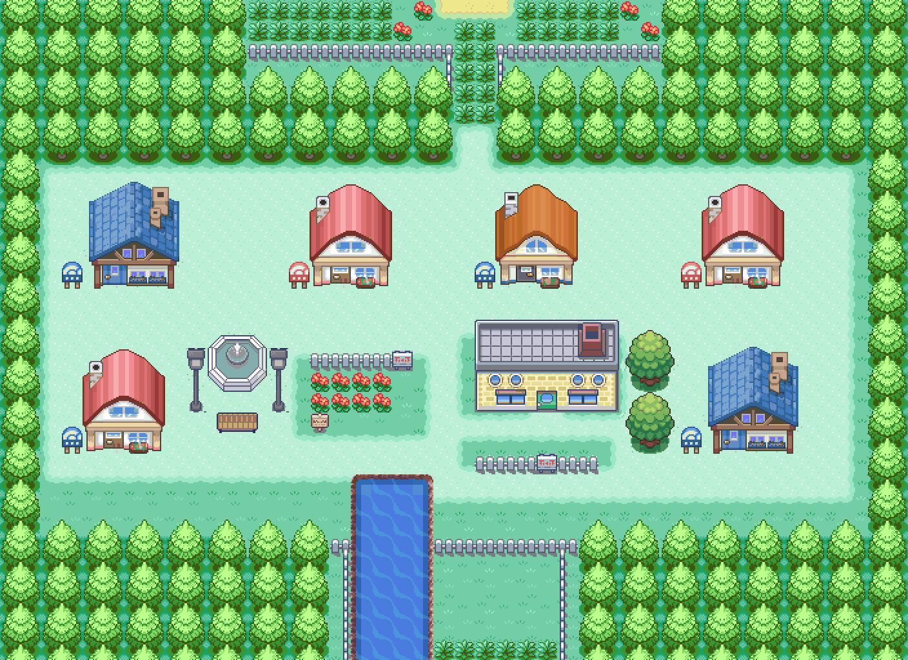

# Expanded Pallet Town for the FireRed decomp

A bigger Pallet Town for [pret/pokefirered](https://github.com/pret/pokefirered):

- **Size:** the map goes from 24×20 to 44×20.
- **New districts:** four new houses with working doors and their own interiors
  (each with a resident to talk to), a fountain plaza and a pine grove.
- **Player and rival homes:** both houses get new art.
- **Kept as in FireRed:** Oak's lab, the garden, the pond and the forest edge.
  All the original events still work, including Oak's "wait, it's unsafe!"
  cutscene, which leads you to the lab.



The overview shows the compiled map, with the bottom of Route 1 above it and the
top of Route 21 below it. The original town is in
`screenshots/pallet_original.png`, and in-game screenshots are in
`screenshots/pallet_ingame.png`.

Tile credits and license terms are in [CREDITS.md](CREDITS.md). The
ChaoticCherryCake tiles are CC BY-NC-SA, so this is **non-commercial only**.

## What changed in the game

| | |
|---|---|
| Layout | `PalletTown_Layout` is now 44 wide. The original town is the middle (shifted 10 columns right); new west and east districts are on either side. |
| Tileset | `gTileset_PalletTown` was redrawn: 384/384 tiles, 6 palettes, 172 metatiles. Metatiles 682/683/690/698 are unchanged, because Route 1 uses them. |
| Neighbours | The Route 1 and Route 21 North connections were re-aligned (offset ±10). Nothing on those routes was changed. |
| Events | All warps, signs, triggers and NPCs moved 10 columns. Hard-coded positions in `PalletTown/scripts.inc` (`setobjectxyperm`, `opendoor`/`closedoor`) and the Pallet heal location were moved too. |
| New maps | `PalletTown_House1`–`4`, reusing the existing house interiors (`LAYOUT_HOUSE1`, `HOUSE2`, `HOUSE5`, `VIRIDIAN_CITY_HOUSE`). |
| Doors | New door-opening animations for each house design. The rival's house and the blue houses have their own door metatiles, registered in `src/field_door.c`. |
| Extras | Mailbox signs for the new houses, and two outdoor NPCs (a girl by the fountain, an old man by the pines). |

Checked in the emulator:

- The intro leads into the new town, and leaving the player's house plays the new door animation.
- Oak's cutscene at the north exit plays and leads you into the lab.
- A new house can be entered, its resident talks, and leaving puts you back at the right door.
- Roofs are drawn over the player when walking behind a house.
- The mailbox signs work.
- Before building, all of Oak's scripted walks were traced against the new
  collision map; none of them pass through a blocked square.

## Rebuilding

```bash
cd pallet-town-upgrade
harness/setup.sh                      # installs the toolchain and clones + builds pokefirered (matching ROM)
git -C pokefirered checkout 037335f4c725d7c9aecdac87066f2002b4bd7e14
git -C pokefirered apply ../pokefirered.patch
make -C pokefirered -j"$(nproc)"      # -> pokefirered/pokefirered.gba
```

To change the design, edit `pallet_upgrade/compose.py` and run
`pallet_upgrade/rebuild.sh`, which runs every step:

1. `compose.py` lays the town out at pixel level, with a ground layer, an
   above-the-player layer and a per-square plan (collision, behaviour, doors).
2. `build.py` turns that into a GBA tileset: it clusters the tiles into 6
   palettes, reduces colours, dedupes tiles with flips, merges near-identical
   tiles if the 384-tile limit is exceeded, and writes metatiles and the map.
3. `doors.py` makes the door animations and registers them.
4. `wire.py` edits the map JSON, scripts, connections, heal location and the
   new interior maps. It always starts from the committed files, so you can
   re-run it.
5. `check_reach.py` flood-fills the built map from the player's door and fails
   the build if any NPC, sign or door can't be reached. `compose.py` also prints
   an audit of squares where an object would be drawn wrongly or block invisibly.

The `pallet_upgrade/orig/` folder is a copy of the original Pallet Town tileset
and map that the pipeline reads from.

## Emulator tools (`harness/`)

- `gba.c` runs the ROM without a screen (via libmgba), using scripted button
  presses, screenshots and save states. With `--record DIR` it saves every frame
  that changes, plus logs of inputs and runs.
- `review.py` browses a recording: a summary, contact sheets, the frame on
  screen at a given time, diffs, and a rebuilt real-time video.
- `tilesets.py` renders any tileset or map from the decomp with its real palettes.
- `qa.py` runs a scripted walk from a save state and puts every screenshot side by
  side, to check door arrivals and how objects are drawn around the player.
